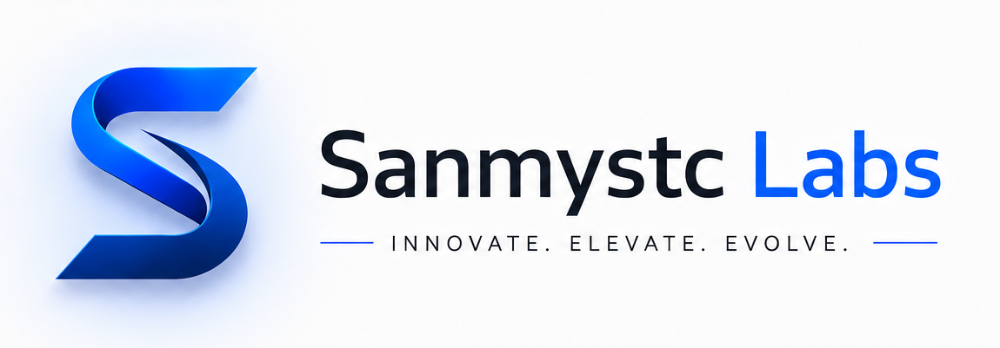

  

# Sanmystc Labs — AI Consulting & Implementation

A modern, responsive website for **Sanmystc Labs**, an AI strategy and implementation consulting firm. The site presents the firm's services, insights, and engagement model for business audiences.

## Pages

- **Home** — Overview of services, client segments, and value proposition
- **About** — Founder story, mission, and approach to AI adoption
- **Services** — Strategy, implementation, and enablement offerings
- **Case Studies** — Featured engagements and business outcomes
- **Insights** — Articles, frameworks, and perspectives on AI strategy
- **Contact** — Inquiry form and engagement options
- **Blogs** — Long-form articles on AI adoption and implementation

## Tech Stack

- HTML5
- Tailwind CSS
- Vanilla JavaScript
- Google Fonts (Inter)

## Getting Started

Open `home.html` in any modern web browser. No build step or server is required.

## Content Updates

- Edit page copy directly in the HTML files
- Add blog posts under the `/blogs` directory
- Replace images in the `/icons` folders as needed

## Contact

Use the contact form on the site.
